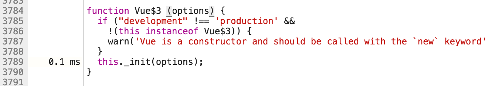

# x 个场景带你逛遍 Vue2 源码（一）

## 前言

React、Angular、Vue可以说是国内比较流行的三种 Web 框架


> 来自[谷歌指数](https://trends.google.com/trends/explore?cat=31&date=today%2012-m&geo=CN&q=React,%2Fm%2F0j45p7w,Angular2,Vue)

其中 Vue 作为后起之秀，以其易上手、低侵入等特点，受到了开发者们的青睐。社区中对 Vue 源码进行剖析的文章也是不少，比如 @XX 的200行代码实现精简版 Vue、老同事@少峰的 Vue 早期源码探索等文章，让笔者也是获益良多。于是按捺不住探索的欲望，也开始的读源码的过程。

当我打开 Vue 项目的时候我当然是**懵逼的**，完全不知道从哪里下手，硬着头皮读完了初始化函数，脑图记了一大片，却依然对整个框架没有整体概念，而面对更加复杂的后续源码，实在是没有驱动力继续读下去了。后来参考了少峰的 Vue 早期源码探索中新颖的源码阅读方式，我也试了一下，不过读来之后又是只知其味，不得其法，数据绑定更新的原理是知道了，但是依然对整个框架的运行过程云里雾里，继续看下去依然几千个 commit，又烂尾了。后来笔者注意到调试工具里面的 Timeline 工具，这个工具一般是用来分析前端性能的，我之前用它来调试过一切奇怪的 bug（比如 Vue2.1.17和2.1.18版本对动画处理的 bug），在阅读源码工作中，Timeline 能够图形化的显示调用栈，你能够很清晰的阅读在特定场景中，整个框架是如何运行的。在知道整体运行框架之后，再去阅读某个小模块的源码才能做到有的放矢，也能知道模块与模块之间的关系，所谓“场景驱动阅读”。你还能调整场景，看在另一个场景中，调用栈是不是改变了，为何而变，涉及到了什么知识点，目前看来是一种可取的阅读方案。

下面我们来实践一下。

## 环境说明：

为了统一读者的运行环境，下面列出本文所用的 Vue 版本及构建方式：

* Vue 版本：`v2.2.4`

* 构建：`vue-cli`

* 初始化：`$ vue init simple learn-vue-source`

* 工具：

  * **Chrome DevTool** 用来查看函数调用栈及断点调试，为了保证时间线的纯净，减少浏览器插件脚本对时间线造成“污染”，请使用隐私模式
  * **WebStorm** 用来在打包前的代码中搜索及跳转模块
  * **lambda-view** 调试工具中的Source 面板没有语法高亮，用它来实现更好的源码阅读体验

## 场景一

```html
<div id="app">
  {{ message }}
</div>
```

```javascript
const app = new Vue({
      el: '#app',
      data: {
      	message: 'Hello, Vue!'
      },
    });
    console.log(app);
```

这个就是官方起步分档中的例子，下面我们在 Timeline 中看一下，这个应用是怎么跑起来的。

首先设置你的 Timeline 如下，这样方便你通过截图来判断，程序开始时间（当然你也可以通过下面的资源占用情况来判断）


刷新页面，等一会我们就能看见生成好的 Timeline 了。


前面一部分有几个匿名函数执行，通过我们的 html 我们可以知道，这里是 vue.js 释放的过程，即做一些环境判断、一些预处理、最后把 Vue 挂在到 window 的过程，最后红框内是我们打 log 的过程，这两个部分我们就不深究了。

ParseHTML和EvaluateScript是浏览器自身的行为，解析HTML和JS，重点关注中间的 vue 运行过程，放大中间部分，能够看到中间这大概20ms 的部分就是 vue 干活的时间了


图中绿色的部分是 vue.js运行时的调用栈，所谓调用栈通俗理解（我就不放学院派的定义了）就是函数调用的顺序，函数都是从顶层向下调用，调用到最下面之后，相邻的同级别的函数执行，继续从上向下调用，类似于下图的方式：


明白了调用栈，我们就看一下我们应用的启动过程吧！从我们的代码上来看，我们先是用`new Vue(xxx)`生成的一个 Vue 的实例，毫无疑问会调用 Vue 的构造函数，在 Timeline 上点击 Vue$3 ，在下面的 Summary 面板上通过点击代码行，我们能够跳转到 Source 面板查看源码。


这就是我们的构造函数:



至于为什么是Vue$3，在这里我还不太明白，可能是不同编译 target 导致的不同吧（从编译后的源码看，runtime 版本的是$2），不过从log出的实例和 `window.Vue`上来看，Vue$3确实是我们的实例。


