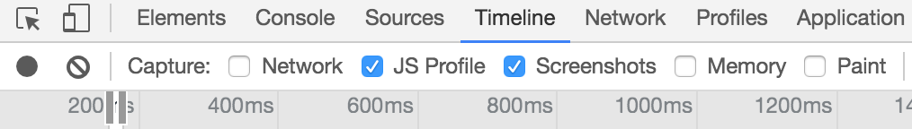
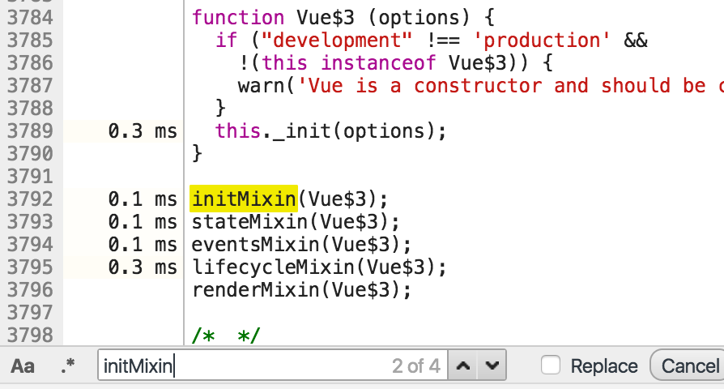
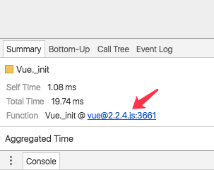
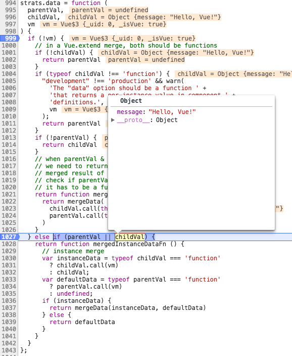

# x 个场景带你逛遍 Vue2 源码（一）

## 前言

React、Angular、Vue可以说是国内比较流行的三种 Web 框架


> 来自[谷歌指数](https://trends.google.com/trends/explore?cat=31&date=today%2012-m&geo=CN&q=React,%2Fm%2F0j45p7w,Angular2,Vue)

其中 Vue 作为后起之秀，以其易上手、低侵入等特点，受到了开发者们的青睐。社区中对 Vue 源码进行剖析的文章也是不少，比如 @XX 的200行代码实现精简版 Vue、老同事@少峰的 Vue 早期源码探索等文章，让笔者也是获益良多。于是按捺不住探索的欲望，也开始的读源码的过程。

当我打开 Vue 项目的时候我当然是**懵逼的**，完全不知道从哪里下手，硬着头皮读完了初始化函数，脑图记了一大片，却依然对整个框架没有整体概念，而面对更加复杂的后续源码，实在是没有驱动力继续读下去了。后来参考了少峰的 Vue 早期源码探索中新颖的源码阅读方式，我也试了一下，不过读来之后又是只知其味，不得其法，数据绑定更新的原理是知道了，但是依然对整个框架的运行过程云里雾里，继续看下去依然几千个 commit，又烂尾了。后来笔者注意到调试工具里面的 Timeline 工具，这个工具一般是用来分析前端性能的，我之前用它来调试过一切奇怪的 bug（比如 Vue2.1.17和2.1.18版本对动画处理的 bug），在阅读源码工作中，Timeline 能够图形化的显示调用栈，你能够很清晰的阅读在特定场景中，整个框架是如何运行的。在知道整体运行框架之后，再去阅读某个小模块的源码才能做到有的放矢，也能知道模块与模块之间的关系，所谓“场景驱动阅读”。你还能调整场景，看在另一个场景中，调用栈是不是改变了，为何而变，涉及到了什么知识点，目前看来是一种可取的阅读方案。

下面我们来实践一下。

## 环境说明：

为了统一读者的运行环境，下面列出本文所用的 Vue 版本及构建方式：

* Vue 版本：`v2.2.4`

* 构建：`vue-cli`

* 初始化：`$ vue init simple learn-vue-source`

* 工具：

  * **Chrome DevTool** 用来查看函数调用栈及断点调试，为了保证时间线的纯净，减少浏览器插件脚本对时间线造成“污染”，请使用隐私模式
  * **WebStorm** 用来在打包前的代码中搜索及跳转模块
  * **lambda-view** 调试工具中的Source 面板没有语法高亮，用它来实现更好的源码阅读体验

## 场景一

```html
<div id="app">
  {{ message }}
</div>
```

```javascript
const app = new Vue({
      el: '#app',
      data: {
      	message: 'Hello, Vue!'
      },
    });
    console.log(app);
```

这个就是官方起步分档中的例子，下面我们在 Timeline 中看一下，这个应用是怎么跑起来的。

首先设置你的 Timeline 如下，这样方便你通过截图来判断，程序开始时间（当然你也可以通过下面的资源占用情况来判断）



刷新页面，等一会我们就能看见生成好的 Timeline 了。


前面一部分有几个匿名函数执行，通过我们的 html 我们可以知道，这里是 vue.js 释放的过程，即做一些环境判断、一些预处理、最后把 Vue 挂在到 window 的过程，最后红框内是我们打 log 的过程，这两个部分我们就不深究了。

ParseHTML和EvaluateScript是浏览器自身的行为，解析HTML和JS，重点关注中间的 vue 运行过程，放大中间部分，能够看到中间这大概20ms 的部分就是 vue 干活的时间了


图中绿色的部分是 vue.js运行时的调用栈，所谓调用栈通俗理解（我就不放学院派的定义了）就是函数调用的顺序，函数都是从顶层向下调用，调用到最下面之后，相邻的同级别的函数执行，继续从上向下调用，类似于下图的方式：


明白了调用栈，我们就看一下我们应用的启动过程吧！从我们的代码上来看，我们先是用`new Vue(xxx)`生成的一个 Vue 的实例，毫无疑问会调用 Vue 的构造函数，在 Timeline 上点击 Vue$3 ，在下面的 Summary 面板上通过点击代码行，我们能够跳转到 Source 面板查看源码。


这就是我们的构造函数的真面目:


（至于为什么是Vue$3，在这里我还不太明白，可能是不同编译 target 导致的不同吧（从编译后的源码看，runtime 版本的是$2），不过从log出的实例和 `window.Vue`上来看，Vue$3确实是我们的实例。）


从函数上我们看到，构造函数调用了实例上面的_init方法，这时实例还没有创建，哪里来的_init方法呢？一定是沿着原型链找到了实例公共方法上面去了，即调用的是Vue.proptotype._init()

沿着这个线索，我们在Source窗口中command+F搜索（windows用户使用xxx+F）.init，于是我们在3661行找到了它的初始定义：


我们发现，Vue.proptotype._init()是定义在一个initMixin函数中的，这个函数又是从哪里运行的呢？继续搜索initMixin：



在构造函数下方，我们看到了他的身影，顺便我们还看到了`stateMixin`、`eventsMixin`、`lifecycleMixin`、`renderMixin`这几个函数调用，从命名上面看，他们分别初始化了**状态相关**、**事件相关**、**生命周期相关**、**渲染相关**的东西。他们都发生在匿名函数执行时，在我们使用Vue类时，他们已经初始化完成了，所以我们先往后面看，待需要的时候回头来看匿名函数都做了什么。

我们继续来看Timeline：


从Timeline上我们看到Vue._init一共做了这么几件事情：
`mergeOptions`、`initRender`、`initState`，然后就是一个长长的 `Vue$3.$mount` 直到视图渲染完成。

在Timeline点击Vue._init，然后在下面Summy面板中点击源码位置，进入Source面板：




前面的if判断似乎是，判断实例是否是一个组件，如果不是组件的话（是根实例），就执行mergeOptions。（在Source中搜索_isComponent，确实搜到了`createComponentInstanceForVnode`方法，与创建实例有关。从注释上看似乎是由于merge操作缓慢，而组件实例又没有必要做这步操作，所以有了这有么一个判断）

我们打上断点看看mergeOptions做了些什么：


mergeOptions传入了三个参数：Vue构造器的options（包括Vue的默认option，全局中使用Vue.config/mixin等等设置的选项）、我们new Vue时传入的options、当前vm实例。

通过点击源码位置，我们找到了`mergeOptions`的函数定义(编译之后的)，通过在各个函数（`checkComponents`, `normalizeProps`, `normalizeDirectives`）上打断点，我们大概理清楚了`mergeOptions`是做什么的：

```javascript
/**
 * Merge two option objects into a new one.
 * Core utility used in both instantiation and inheritance.
 */
function mergeOptions (
  parent, // Vue的默认option，全局中使用Vue.config/mixin等等设置的选项
  child, // 我们new Vue时传入的options
  vm // 当前vm实例
) {
  {
    // 检测我们输入的options.component中是否有Vue的保留关键字
    // 如组件不能命名成slot，component，也不能命名成html和svg中已有的标签名
    // 我们的这个场景是根元素，所以这个部分就不跑了
    checkComponents(child);
  }
  // 这个函数是对我们自己传入的options.props进行格式化，用来支持数组和对象另种props形式
  // 经过他的处理，props都变成了对象形式，同时对prop的类型做了处理
  // 需要注意的是
  // 1. 数组声明的方式下，prop的类型声明在这里被统一为null（编译后的第1161行）
  // 2. 数组声明方式下，每个prop声明必须是字符串类型的，否则会报警告
  // 3. 数组/对象声明方式下，每个prop命名在这里都被转换成了驼峰命名风格
  // 4. 转换结果：
  //    ['one-prop'] => { oneProp: { type: null } }
  //    { one: Number, two: { type: Number, default: 1, .... } }
  //    => { one: { type: Number }, two: { type: Number, default: 1, .... } }
  // 当前场景中并没有用到，所以跳过
  normalizeProps(child);

  // 格式化用户在实例上自定义的指令，即 options.directive，支持对象方式定义，和函数方式定义
  // 如果是直接用函数的方式定义的话，会在这里被转换成对象形式
  // 转换结果：
  // directives: { direc: function() {} }
  // =>
  // directives: { direc: { bind: function() {}, update: function() {} }}
  // 当前场景中并没有用到，所以跳过
  normalizeDirectives(child);
  var extendsFrom = child.extends;

  // 处理在options中使用extends写法，用以支持声明式扩展/继承另一个组件，而不必使用Vue.extend
  // 自然，被扩展的组件也需要mergeOptions
  // 当前场景中并没有用到，所以跳过
  if (extendsFrom) {
    parent = typeof extendsFrom === 'function'
      ? mergeOptions(parent, extendsFrom.options, vm)
      : mergeOptions(parent, extendsFrom, vm);
  }

  // 处理使用mixin的情况，方便做细粒度的组件复用
  // 当前场景中并没有用到，所以跳过
  if (child.mixins) {
    for (var i = 0, l = child.mixins.length; i < l; i++) {
      var mixin = child.mixins[i];
      if (mixin.prototype instanceof Vue$3) {
        mixin = mixin.options;
      }
      parent = mergeOptions(parent, mixin, vm);
    }
  }
  var options = {};
  var key;
  for (key in parent) {
    mergeField(key);
  }
  for (key in child) {
    if (!hasOwn(parent, key)) {
      mergeField(key);
    }
  }
  function mergeField (key) {
    var strat = strats[key] || defaultStrat;
    options[key] = strat(parent[key], child[key], vm, key);
  }
  return options
}
```

我们刚才一连跳过了5个函数，跳过是因为我们既没有子组件、也没扩展构造器、也没使用混入、也没自定义指令及props，这也就解答了我们在Timeline上为何只看到了mergeFields一个函数执行的原因，Timeline忠实地为我们记录了一切。**这也是使用Timeline查看源码的好处：跳过在当前场景无用的函数，专注于对整个框架运行的理解，同时也能减少读源码的压力。**

接下来就是看看这唯一执行的 mergeField做了什么吧：

这里面有个变量 `strat` 让人比较疑惑：其实这里运用了一个**策略模式**，就是我们打算合并的 key 不同，是有不同的合并策略的（举例说一下有哪些不同，比如说某些是 child 覆盖 parent，有些则是 parent 覆盖 child），这里的 `strat` 其实就是 stratgy 的意思，比如合并 `component` 属性时，根据 `key` 使用合并 component 时的策略。然后让策略执行，传入 `mergeOptions` 传入的参数。

还记得 mergeOption 传入了什么参数吗？

mergeOptions传入了三个参数：`parent`:Vue构造器的options、`child`:我们new Vue时传入的options || {}、`vm`:当前vm实例。

通过 mergeFiled，我们的 options 变成了如下结构：

merge之前：


之后：


然后问题来了：我们的 `message` 哪去了？

这就是策略搞的鬼，合并`data`字段的处理策略在*994行*，在我们的场景下，代码走了*1028行*的分支，策略执行完直接返回了一个函数，我们的`message`在策略执行的函数的闭包中被保存了下来，`option.data`的这个函数将在后续处理中被调用。



回到initMixin，看看我们运行到哪里了：

为何 initLifeCycle 等没有显示在 timeline 中呢？

根据 timeline，mergeoptions 结束之后，我们跳过那些没有执行的代码，就到了 initRender 的部分了：

我们继续往下看：


我们在这里发现了 data 是 function 的情况（最开始就是 function），是怎么处理的：


另一个发现是$options.data在 mergeOptions 之后是一个函数，这个函数是根据 data 的 strategy merge 上去的，在$options.data执行之后，data 会被合并，合并之后的结果返回


再接下来发现了 proxy 方法及共享的 defineProperty 配置：


proxy(target, sourceKey, key) 的作用是为 sourceKey 配置 Object.defineProperty,  当我访问vm.message的时候返回vm._data.message，当我设置vm.message的时候，返回vm._data.message，可配置且可枚举，这部分就是把 data 放到了实例上面，并配置存取方法，去存取vm._data，完成了内部属性_和外部实例属性 message 的连接。

然后就进入到了 Vue 最吸引人的方法，observe方法中啦：


我们发现了 Observer 的类：


继续往下看：

顺手我们学到了如何判断对象：


然后是怎么走 walk 实现递归观察。

然后 initState 就走完了。

根据 Timeline，我们继续来看编译部分：

我们又遇到了这种写法：


笔者开始也很奇怪为何会有这种写法，最后通过在编辑器中对打包前的源码进行搜索才明白，这部分是根据env环境不同选择性生成代码的结果，就是源码中这一段：


在开发环境中Vue尽可能增加了warning，error的提醒，而在生产环境中，他们都是不需要的，所以通过这种机制来处理。

可能有读者在这里就奇怪了，mergeOptions中明明有很多函数执行，为何timeline上只显示了一个呢？
我们在调用栈上也只看到了少量函数执行。


我们稍后就为大家揭晓答案。