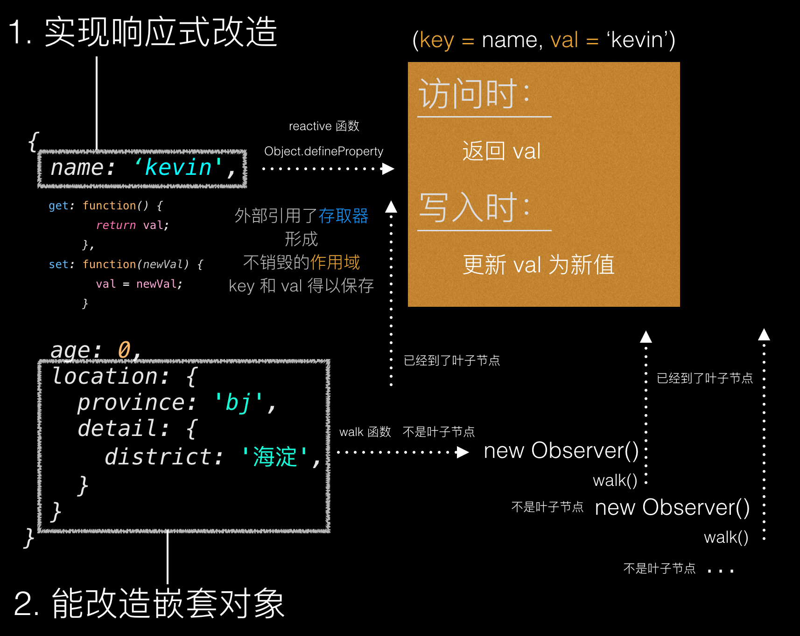

## 响应式要达到的几种效果
1. 拦截扁平对象键值的get/set

  ```javascript
  var a = {
    name: 'kevin',
    age: 0,
  };

  for(let key in a) {
    if(a.hasOwnProperty(key)) {
      reactive(a, key, a[key]); // 对每一个键，生成一个闭包，把键值传入
    }
  }

  function reactive(obj, key, val) {
    Object.defineProperty(obj, key, {
      get: function() {
        console.log(`访问${key}`);
        return val;  // get的时候访问闭包中的val
      },
      set: function(newVal) {
        console.log(`写入${key}:${newVal}`);
        val = newVal;  // set的时候修改闭包中的val，实际上a中的属性根本就没改，只是set被我们拦截了下来，改了get要返回的闭包中的值而已
      }
    });
  }

  // 测试
  ```
2. 对于嵌套的对象，能够保证上一条效果

  ```javascript
  var a = {
    name: 'kevin',
    age: 0,
    location: {
      province: 'bj',
      detail: {
        district: 'haidian',
      }
    }
  };

  function walk(obj) {
    const isObject = (value) => Object.prototype.toString.call(value) === '[object Object]';

    for (var key in obj) {
      if (obj.hasOwnProperty(key)) {
        var item = obj[key];
        if (isObject(item)) {
          arguments.callee(item);
        } else {
          reactive(obj, key, item); // 对每一个不是对象的键，生成一个闭包，把键值传入
        }
      }
    }
  }
 
  function reactive(obj, key, val) {
    Object.defineProperty(obj, key, {
      get: function() {
        console.log(`访问${key}`);
        return val;  // get的时候访问闭包中的val
      },
      set: function(newVal) {
        console.log(`写入${key}:${newVal}`);
        val = newVal;  // set的时候修改闭包中的val
      }
    });
  }

  walk(a);

  // 测试
  ```
3. 按照源码的风格封装了一下：

  ```javascript
  var a = {
    name: 'kevin',
    age: 0,
    location: {
      province: 'bj',
      detail: {
        district: 'haidian',
      }
    }
  };

  class Observer {
    constructor(data) {
      this.data = data;

      if (Observer.isObject(data)) {
        this.walk(data);
      } else {
        console.error(`${Object.prototype.toString.call(data)} 不是对象`);
      }
    }

    static isObject(value) {
      return Object.prototype.toString.call(value) === '[object Object]'
    }

    walk(obj) {
      for (var key in obj) {
        if (obj.hasOwnProperty(key)) {
          var item = obj[key];
          if (Observer.isObject(item)) {
            new Observer(item);
          } else {
            this.reactive(obj, key, item); // 对每一个不是对象的键，生成一个闭包，闭包不会被销毁
          }
        }
      }
    }

    reactive(obj, key, val) {
      Object.defineProperty(obj, key, {
        get: function() {
          console.log(`访问${key}`);
          return val;  // get的时候访问闭包中的val
        },
        set: function(newVal) {
          console.log(`写入${key}:${newVal}`);
          val = newVal;  // set的时候修改闭包中的val
        }
      });
    }
  }

  new Observer(a);
  ```


## 改造
## 变更触发
## 一个 Watch 工具库
